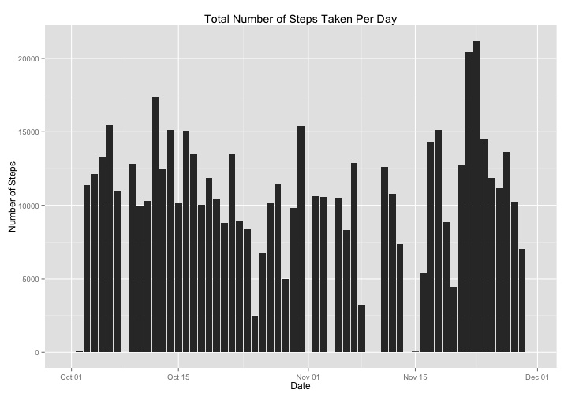

# Reproducible Research: Peer Assessment 1

## The Dataset used for the assignment

The data for this assignment was obtained from a personal activity monitoring  
device. Over the course of two months, October and November 2012, an anonmymous  
individual used the device to collect personal movement data that included the  
number of steps taken in 5 minute intervals each day. 

The steps data for this assignment can be downloaded from Dr. Roger Peng's   
Reproducible Research course website.

+ **Dataset:** [Activity monitoring data][1] [52K]
[1]: https://d396qusza40orc.cloudfront.net/repdata%2Fdata%2Factivity.zip  
"Activity monitoring data"

The dataset includes three variables:

1. **steps:**  The number of steps that were taken by the individual in each  
5-minute interval (missing values are represented by NA)

2. **data:**  The date on which the data was acquired in YYYY-MM-DD format
    
3. **interval:**  An identifier for the 5-minute interval in which the data was  
acquired

The dataset is stored in a comma-separated-value (CSV) file. There are a total  
of 17,568 observations.

## Goals of the Assignment

In this assignment, the steps data was used to answer the following three  
questions:

1. What was the mean total number of steps taken per day? (Missing values not  
imputed)

2. What was the average daily activity pattern? (Missing values not imputed)

3. Are there differences in activity patterns between weekdays and weekends?  
(Missing values imputed)

## Loading and preprocessing the data

### Download data and read from csv file into data frame

While, the github repository does contain the activity data in a zip file, I  
have opted to download the data from  the Course website cited above.

If directory to contain the data does not exist, make the directory


```r
if(!file.exists("Steps_Data")) {
    dir.create("Steps_Data")
}
```

Download the zip file


```r
zipURL <- "https://d396qusza40orc.cloudfront.net/repdata%2Fdata%2Factivity.zip"
download.file(zipURL,"./Steps_Data/temp",method = "curl")
```

Unzip zip file


```r
unzip("./Steps_Data/temp", exdir = "./Steps_Data/")
```

Delete the zip file


```r
unlink("./Steps_Data/temp")
```

Read data from csv file into data frame and view head of data frame


```r
stepData <- read.table("./Steps_Data/activity.csv", header = TRUE, sep = ",",
                       na.strings = "NA", 
                       colClasses = c("integer","character","integer"))
head(stepData)
```

```
##   steps       date interval
## 1    NA 2012-10-01        0
## 2    NA 2012-10-01        5
## 3    NA 2012-10-01       10
## 4    NA 2012-10-01       15
## 5    NA 2012-10-01       20
## 6    NA 2012-10-01       25
```

### Preprocess the data

Convert dates which currently have class "character" to Date Objects


```r
stepData$date <- as.Date(stepData$date)
```

## What is mean total number of steps taken per day?

Load ggplot2 package for graphics generation
Load plyr package for ddply function


```r
library(ggplot2)
library(plyr)
```

Generate histogram of total number of steps taken per day


```r
totalSteps <- ddply(stepData, c("date"),summarize,  
                    Frequency = sum(steps, na.rm = TRUE))
grob <- ggplot(totalSteps, aes(x = date, y = Frequency)) + geom_bar(stat = "identity")
print(grob)
```

 

Calculate mean and median total number of steps taken per day


```r
theMean <- mean(totalSteps$Frequency)
theMedian <- median(totalSteps$Frequency)
```

The mean total number of steps taken per day is 9354.2295   
The median total number of steps taken pre day is 10395

## What is the average daily activity pattern?

```r
meanSPI <- ddply(stepData, c("interval"),summarise,  
                 mean = mean(steps, na.rm = TRUE))
timeGrob <- ggplot(meanSPI, aes(x = interval, y = mean)) + geom_line() + geom_point()
print(timeGrob)
```

 

Determine which 5-minute interval across all the days in the dataset, contains
the maximum number of steps taken.


```r
meanSPI$interval[which.max(meanSPI$mean)]
```

```
## [1] 835
```
## Imputing missing values


## Are there differences in activity patterns between weekdays and weekends?

## Software Environment 


```r
sessionInfo()
```

```
## R version 3.0.3 (2014-03-06)
## Platform: x86_64-apple-darwin10.8.0 (64-bit)
## 
## locale:
## [1] en_US.UTF-8/en_US.UTF-8/en_US.UTF-8/C/en_US.UTF-8/en_US.UTF-8
## 
## attached base packages:
## [1] stats     graphics  grDevices utils     datasets  methods   base     
## 
## other attached packages:
## [1] plyr_1.8.1    ggplot2_1.0.0 knitr_1.6    
## 
## loaded via a namespace (and not attached):
##  [1] colorspace_1.2-4 digest_0.6.4     evaluate_0.5.5   formatR_0.10    
##  [5] grid_3.0.3       gtable_0.1.2     labeling_0.2     MASS_7.3-33     
##  [9] munsell_0.4.2    proto_0.3-10     Rcpp_0.11.2      reshape2_1.4    
## [13] scales_0.2.4     stringr_0.6.2    tools_3.0.3
```
