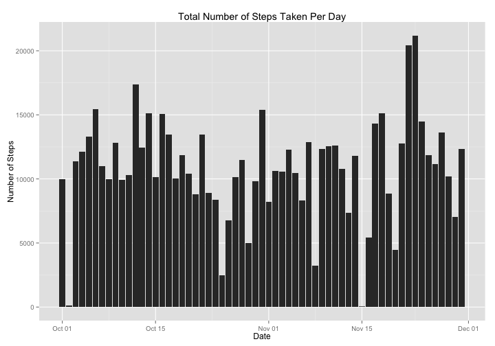

# Reproducible Research: Peer Assessment 1

## The Dataset used for the assignment

The data for this assignment was obtained from a personal activity monitoring  
device. Over the course of two months, October and November 2012, an anonmymous  
individual used the device to collect personal movement data that included the  
number of steps taken in 5 minute intervals each day. 

The steps data for this assignment can be downloaded from Dr. Roger Peng's   
Reproducible Research course website.

+ **Dataset:** [Activity monitoring data][1] [52K]
[1]: https://d396qusza40orc.cloudfront.net/repdata%2Fdata%2Factivity.zip  
"Activity monitoring data"

The dataset includes three variables:

1. **steps:**  The number of steps that were taken by the individual in each  
5-minute interval (missing values are represented by NA)

2. **data:**  The date on which the data was acquired in YYYY-MM-DD format
    
3. **interval:**  An identifier for the 5-minute interval in which the data was  
acquired

The dataset is stored in a comma-separated-value (CSV) file. There are a total  
of 17,568 observations.

## Goals of the Assignment

In this assignment, the steps data was used to answer the following three  
questions:

1. What was the mean total number of steps taken per day? (Missing values not  
imputed)

2. What was the average daily activity pattern? (Missing values not imputed)

3. Are there differences in activity patterns between weekdays and weekends?  
(Missing values imputed)

## Loading and preprocessing the data

### Download data and read from csv file into data frame

While, the github repository does contain the activity data in a zip file, I  
have opted to download the data from  the Course website cited above.

If directory to contain the data does not exist, make the directory


```r
if(!file.exists("Steps_Data")) {
    dir.create("Steps_Data")
}
```

Download the zip file


```r
zipURL <- "https://d396qusza40orc.cloudfront.net/repdata%2Fdata%2Factivity.zip"
download.file(zipURL,"./Steps_Data/temp",method = "curl")
```

Unzip zip file


```r
unzip("./Steps_Data/temp", exdir = "./Steps_Data/")
```

Delete the zip file


```r
unlink("./Steps_Data/temp")
```

Read data from csv file into data frame and view head of data frame


```r
stepData <- read.table("./Steps_Data/activity.csv", header = TRUE, sep = ",",
                       na.strings = "NA", 
                       colClasses = c("integer","character","integer"))
head(stepData)
```

```
##   steps       date interval
## 1    NA 2012-10-01        0
## 2    NA 2012-10-01        5
## 3    NA 2012-10-01       10
## 4    NA 2012-10-01       15
## 5    NA 2012-10-01       20
## 6    NA 2012-10-01       25
```

### Preprocess the data

Convert dates which currently have class "character" to Date Objects


```r
stepData$date <- as.Date(stepData$date)
```

## What is mean total number of steps taken per day?

Load ggplot2 package for graphics generation
Load plyr package for ddply function


```r
library(ggplot2)
library(plyr)
```

Generate histogram of total number of steps taken per day


```r
totalSteps <- ddply(stepData, c("date"),summarize,  
                    Frequency = sum(steps, na.rm = TRUE))
grob <- ggplot(totalSteps, aes(x = date, y = Frequency)) + geom_bar(stat = "identity")
print(grob)
```

 

Calculate mean total number of steps taken per day


```r
mean(totalSteps$Frequency)
```

```
## [1] 9354
```

Calculate median total number of steps taken per day   


```r
median(totalSteps$Frequency)
```

```
## [1] 10395
```

## What is the average daily activity pattern?

```r
meanSPI <- ddply(stepData, c("interval"),summarise,  
                 mean = mean(steps, na.rm = TRUE))
timeGrob <- ggplot(meanSPI, aes(x = interval, y = mean)) + geom_line() + geom_point()
print(timeGrob)
```

 

Determine which 5-minute interval across all the days in the dataset, contains
the maximum number of steps taken.


```r
meanSPI$interval[which.max(meanSPI$mean)]
```

```
## [1] 835
```
## Imputing missing values

* Calculate and report the total number of missing values in the data set.


```r
sum(is.na(stepData$steps))
```

```
## [1] 2304
```

* Devise a strategy for filling in all the missing values in the data set

To devise a reasonable strategy for imputing the missing data values, I  
needed to get an idea of how the NAs were distributed throughout the data set.
For each date, I determined the percentage of values that were NA.


```r
dailyNAs <- ddply(stepData, c("date"),summarize,
                  percent_NA = 100 * sum(is.na(steps))/length(steps))
day_of_week <- weekdays(dailyNAs$date)
dailyNAs <- cbind(day_of_week, dailyNAs)
print(dailyNAs)
```

```
##    day_of_week       date percent_NA
## 1       Monday 2012-10-01        100
## 2      Tuesday 2012-10-02          0
## 3    Wednesday 2012-10-03          0
## 4     Thursday 2012-10-04          0
## 5       Friday 2012-10-05          0
## 6     Saturday 2012-10-06          0
## 7       Sunday 2012-10-07          0
## 8       Monday 2012-10-08        100
## 9      Tuesday 2012-10-09          0
## 10   Wednesday 2012-10-10          0
## 11    Thursday 2012-10-11          0
## 12      Friday 2012-10-12          0
## 13    Saturday 2012-10-13          0
## 14      Sunday 2012-10-14          0
## 15      Monday 2012-10-15          0
## 16     Tuesday 2012-10-16          0
## 17   Wednesday 2012-10-17          0
## 18    Thursday 2012-10-18          0
## 19      Friday 2012-10-19          0
## 20    Saturday 2012-10-20          0
## 21      Sunday 2012-10-21          0
## 22      Monday 2012-10-22          0
## 23     Tuesday 2012-10-23          0
## 24   Wednesday 2012-10-24          0
## 25    Thursday 2012-10-25          0
## 26      Friday 2012-10-26          0
## 27    Saturday 2012-10-27          0
## 28      Sunday 2012-10-28          0
## 29      Monday 2012-10-29          0
## 30     Tuesday 2012-10-30          0
## 31   Wednesday 2012-10-31          0
## 32    Thursday 2012-11-01        100
## 33      Friday 2012-11-02          0
## 34    Saturday 2012-11-03          0
## 35      Sunday 2012-11-04        100
## 36      Monday 2012-11-05          0
## 37     Tuesday 2012-11-06          0
## 38   Wednesday 2012-11-07          0
## 39    Thursday 2012-11-08          0
## 40      Friday 2012-11-09        100
## 41    Saturday 2012-11-10        100
## 42      Sunday 2012-11-11          0
## 43      Monday 2012-11-12          0
## 44     Tuesday 2012-11-13          0
## 45   Wednesday 2012-11-14        100
## 46    Thursday 2012-11-15          0
## 47      Friday 2012-11-16          0
## 48    Saturday 2012-11-17          0
## 49      Sunday 2012-11-18          0
## 50      Monday 2012-11-19          0
## 51     Tuesday 2012-11-20          0
## 52   Wednesday 2012-11-21          0
## 53    Thursday 2012-11-22          0
## 54      Friday 2012-11-23          0
## 55    Saturday 2012-11-24          0
## 56      Sunday 2012-11-25          0
## 57      Monday 2012-11-26          0
## 58     Tuesday 2012-11-27          0
## 59   Wednesday 2012-11-28          0
## 60    Thursday 2012-11-29          0
## 61      Friday 2012-11-30        100
```

A quick glance at the the dailyNAs data frame reveals that each day either has   
all missing values (100%) or no missing values (0%). Out of the 61 days, there   
are 8 days for which all of the values are missing. Two of these days fall on a  
Monday, two on a Friday, and one each on Wednesday, Thursday, Saturday, and,   
Sunday. Based on this data I will use the following imputation strategy:

For each five-minute interval, I will replace the missing value with the mean of    
the five-minute interval for that particular weekday (e.g. if the missing value    
occurs at interval 4 on a Sunday, I will replace the missing value with the mean   
number of steps for interval 4's that occur on Sundays).

Generate table of values to be used for imputation.


```r
day <- factor(
    weekdays(stepData$date),
    c("Monday","Tuesday","Wednesday","Thursday","Friday","Saturday","Sunday"))
stepData <- cbind(day,stepData)
imputationTable <- ddply(stepData, c("day","interval"), summarize,
                          mean = mean(steps, na.rm = TRUE))
```

Data collection began on 2012-10-01, a Monday, and ended on 2012-11-30, a   
Friday. Data was collected for 61 days with the steps recorded for 288  
five-minute intervals each day for a total of 17568 observations. The imputation   
table contains the means of the 288 intervals for each of the 7 days   
(Monday- Sunday) resulting in 2016 rows. To vectorize the missing value  
replacement operation, will generate a vector of length 17568 from the   
imputation Table's mean number of steps column


```r
impVec <- c(rep(imputationTable$mean, times = 8),imputationTable$mean[1:1440])
```

Replace any missing value with its imputed value.


```r
stepData$steps[is.na(stepData$steps)] <- impVec[is.na(stepData$steps)]
```

Generate histogram of total number of steps taken per day


```r
totalSteps <- ddply(stepData, c("date"),summarize,  
                    Frequency = sum(steps, na.rm = TRUE))
grob <- ggplot(totalSteps, aes(x = date, y = Frequency)) + geom_bar(stat = "identity")
print(grob)
```

 

Calculate mean total number of steps taken per day


```r
mean(totalSteps$Frequency)
```

```
## [1] 10821
```

Calculate median total number of steps taken per day   


```r
median(totalSteps$Frequency)
```

```
## [1] 11015
```

## Are there differences in activity patterns between weekdays and weekends?


## Software Environment 


```r
sessionInfo()
```

```
## R version 3.0.3 (2014-03-06)
## Platform: x86_64-apple-darwin10.8.0 (64-bit)
## 
## locale:
## [1] en_US.UTF-8/en_US.UTF-8/en_US.UTF-8/C/en_US.UTF-8/en_US.UTF-8
## 
## attached base packages:
## [1] stats     graphics  grDevices utils     datasets  methods   base     
## 
## other attached packages:
## [1] plyr_1.8.1    ggplot2_1.0.0 knitr_1.6    
## 
## loaded via a namespace (and not attached):
##  [1] colorspace_1.2-4 digest_0.6.4     evaluate_0.5.5   formatR_0.10    
##  [5] grid_3.0.3       gtable_0.1.2     labeling_0.2     MASS_7.3-33     
##  [9] munsell_0.4.2    proto_0.3-10     Rcpp_0.11.2      reshape2_1.4    
## [13] scales_0.2.4     stringr_0.6.2    tools_3.0.3
```
